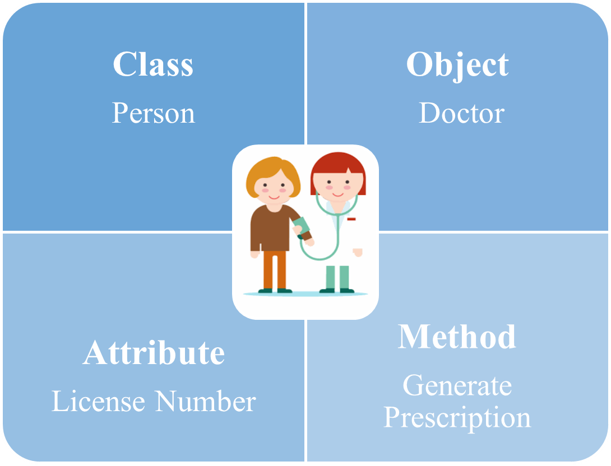
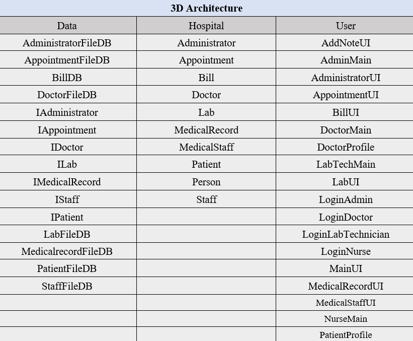
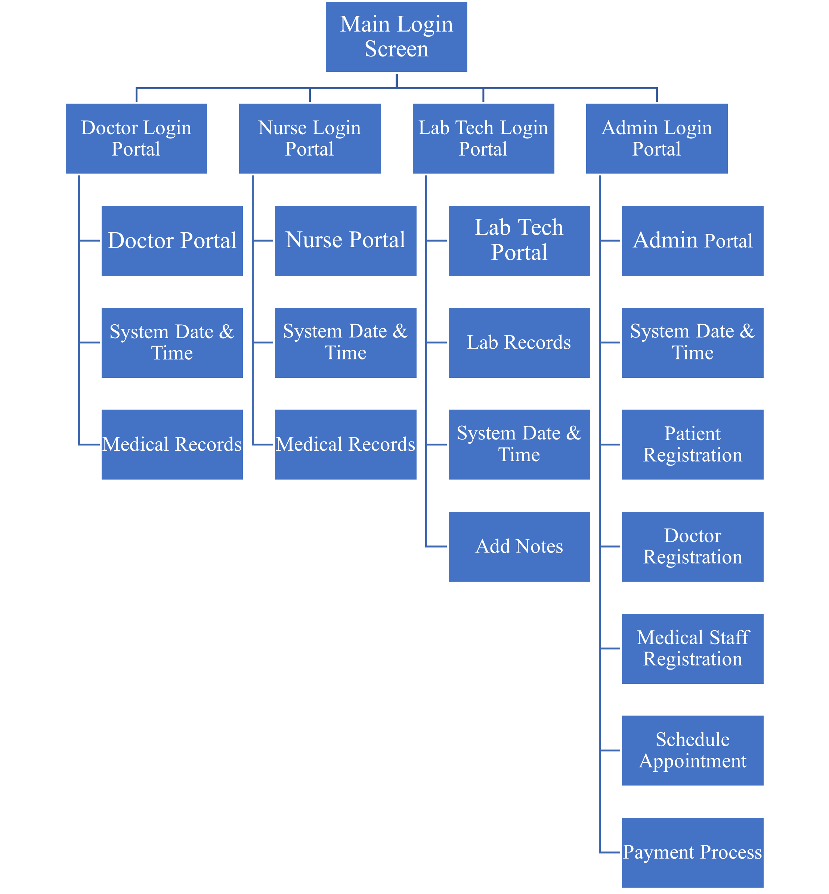

# 🏥 MediCare Hospital Management System

<p align="justify"> MediCare Hospital Management System provides high-quality healthcare services, including outpatient consultations, inpatient care, emergency services, and diagnostic procedures, with a focus on care and responsibility. </p>

## Introduction

<p align="justify"> The system is developed using a three-tier (3D) architecture, which is organized into <code> User </code>, <code> Hospital </code> and <code> Data </code>. The <code> User </code> package includes graphical user interfaces. That provides a high-level user-friendly experience for users. The <code> Hospital </code> package contains object-oriented classes, including <code> Administrator </code>, <code> Appointment </code>, <code> Bill </code>, <code> Doctor </code>, <code> Lab </code>, <code> MedicalRecord </code>, <code> MedicalStaff </code>, <code> Patient </code>, <code> Person </code>, and <code> Staff </code>. The <code> Data </code> package is responsible for file handling. However, that provides benefits including faster development, improved scalability, reliability and security in the system. <br> <br> 
The system uses the Java programming language and the Object-Oriented Programming (OOP) principle. The solution demonstrates the application of <B> Object</B>, <B> Class</B>, <B> Abstraction</B>, <B> Inheritance</B>, <B> Encapsulation</B> and <B> Polymorphism</B>. Furthermore, the system allows handling unexpected errors using a <B> try-catch block</B>. </p>

---

## Application of Object-Oriented Programming

<p align="justify"> Java is used for Object-Oriented Programming. That style is closer to the real-world scenarios, such as a Hospital Management System (HMS). The structure contains objects, classes, methods and attributes. That consists of main principles such as <B> Object</B>, <B> Class</B>, <B> Abstraction</B>, <B> Inheritance</B>, <B> Encapsulation</B> and <B> Polymorphism</B>.  </p> <br>

<p align="center">
  
</p>

### Object 

<p align="justify"> Objects have characteristics which are used to describe them. These characteristics are known as attributes. An attribute defines the current state of an object. </p>

In this system, P is an object of the <code> Patient </code> class. This object contains patient-specific data.

```
Patient p=new Patient(pID, firstName, lastName, dateOfBirth,gender, contactNumber, emergencyContact, email, address, patientID, registrationDate, bloodGroup,nallergies, insuranceInfo);
```

<p align="justify"> Moreover, the code below represents a data handler object in the <code> DoctorProfile </code> JFrame Form. object <code> dfDB </code> is created from the <code> DoctorFileDB </code> class, which is used for handling patient-related data operations using file handling techniques. </p>

```
dfDB=new DoctorFileDB();
```

### Class

<p align="justify"> Classes can be described as a blueprint for an object. This system uses several classes, such as <code> Administrator </code>, <code> Appointment </code>, <code> Bill </code>, <code> Doctor </code>, <code> Lab </code>, <code> MedicalRecord </code>, <code> MedicalStaff </code>, <code> Patient </code>, <code> Person </code>, <code> Staff </code>, <code> AdministratorFileDB </code>, <code> AppointmentFileDB </code>, <code> BillDB </code>, <code> DoctorFileDB </code>, <code> LabFileDB </code>, <code> MedicalRecordFileDB </code>, <code> PatientFileDB </code>, and <code> StaffFileDB </code> etc. </p>

```
public class Appointment {
	//class variables and methods
}
```

### Abstraction

<p align="justify"> Data abstraction provides an essential feature to the outside without including implementation details. For example, abstraction is used in the <code> Person </code> abstract class. It provides common properties and methods to <code> Administrator </code>, <code> Doctor </code>, <code> MedicalStaff </code>, and <code> Patient </code> classes. </p>

```
public abstract class Person {
	//abstract class variables and methods
}
```

The <code> Ipatient </code> interface used abstraction. It does not have concrete methods and a completely abstract class that contains only abstract methods.

```
public interface Ipatient {
	 public abstract boolean registerPatient(Patient p);
     public abstract Patient findPatient(int pID);
	 public abstract boolean removePatient(int pID);
     public abstract boolean updateMedicalInfo(Patient p);
     public abstract ArrayList<Patient> getMedicalHistory();
}
````

### Inheritance

<p align="justify"> Inheritance is the process that is used to gain properties (variables and methods) from one class to another. It provides to manage information in hierarchical order. The class inheriting the properties of another is the subclass, and the class whose properties are inherited is the superclass. </p>

```
public class Administrator extends Person {
	//subclass variables and methods
}
```
In this scenario, the <code> Administrator </code> class inherits the <code> lastName </code>, <code> gender </code>, and <code> address </code> from the <code> Person </code> class.

```
public Administrator(int adminID,  String lastName, String gender, String address, String accessLevel, String department, Date hireDate, String adminType) {
     super(lastName, gender, address); 
	 this.adminID = adminID;
     this.accessLevel = accessLevel;
     this.department = department;
     this.hireDate = hireDate;
     this.adminType = adminType;
}
```

### Encapsulation

<p align="justify"> Encapsulation refers to wrapping data and methods into a class. The variables of one class will be hidden from the other classes and accessible only through the methods of the current class. That is called data hiding. </p>
	
<p align="justify"> To achieve encapsulation in this project, declare the class’s variable as private and provide public setter and getter methods to modify and view the variable’s values. For example, in the <code> Person </code> class, variables such as <code> personID </code>, <code> firstName </code>, <code> lastName </code>, <code> dateOfBirth </code>, <code> gender </code>, <code> contactNumber </code>, <code> email </code>, and <code> address </code> are declared as private. In contrast, methods are declared as public. </p>

```
private int personID;

public int getPersonID() {
        return personID;
}

public void setPersonID(int personID) {
        this.personID = personID;
}  
```

### Polymorphism

<p align="justify"> Polymorphism refers to the idea of having many forms. This project uses method overriding and overloading. 

In overriding, a subclass can implement a superclass method based on its requirements. That is called run-time polymorphism. </p>

```
public interface IDoctor {
    public abstract boolean addDoctor(Doctor d);
}
```

<p align="justify"> In the <code> IDoctor </code> interface, the abstract method <code> IDoctor </code> was used to hide information, and <code> DoctorFileDB </code> implemented it. </p>

```
public class DoctorFileDB implements IDoctor {
	//database implementation
}

@Override
public boolean addDoctor(Doctor d) {
       //File Handling code with try-catch block    
}
```

In overloading, the <code> Person </code> abstract class is defined multiple constructors with the same name but different parameters.  That is known as compile-time polymorphism.

```
public abstract class Person {
    private int personID;
    private String firstName;
    private String lastName;
    private Date dateOfBirth;
    private String gender;
    private int contactNumber;
    private String email;
    private String address;

    //Constructor 1
    public Person(String lastName, String gender, int contactNumber) {
        this.lastName = lastName;
        this.gender = gender;
        this.contactNumber = contactNumber;
    } 

    //Constructor 2 (Overloaded)
    public Person(String lastName, String gender, String address) {
        this.lastName = lastName; 
        this.gender = gender;
        this.address = address;
    }
}
````

---

## Main Functions

<p align="justify"> The system consists of login portals, main role portals, menu bars, and data input interfaces. That supports users to work easily on the MediCare Hospital Management System. </p>

### System Login

<p align="justify"> The system offers separate user login options, including portals for doctors, nurses, lab technicians, and administrators. That ensures the system is secure from unauthorized login access and provides a more secure system for users. When the user enters the correct User Name or password, the user is directed to the relevant role's main portal. When a user logs in with an invalid User Name or password, it displays a dialog box with “Incorrect User Name or Password”. </p>

```
if (userName.equals("Admin")&&(password.equals("123"))){
            AdminMain aUI = new AdminMain();
            aUI.setVisible(true);
            this.setVisible(false);
} else {
            JOptionPane.showMessageDialog(rootPane, "Incorrect User Name or Password");
}
```
The above code snippet shows how to secure a system by using an if-else condition.

### System Structure

<p align="justify"> The system employs a three-tier (3D) architecture, organized into <code> User </code>, <code> Hospital </code> and <code> Data </code> tiers. </p>

<p align="center">
  
</p>

<p align="justify"> The <code> User </code> package includes graphical user interfaces. The <code> Hospital </code> package contains classes which involve the Object-Oriented Programming (OOP) Principle. The <code> Data </code> package is responsible for the file handling process of the system. </p>

### Role Portals

<p align="justify"> After a user successfully logs in, the system will be directed to the relevant role’s Portals. That consists of the menu bar, function buttons and the Logout button. The Logout button returns to the main login screen. The function buttons are directed to the specific operation interfaces. That interface consists of the data handle buttons and the Exit button. The Exit button again returns to the relevant role’s Portals. Moreover, <B>CRUD</B> Operations allow a system to create, read, update and delete data effectively using GUIs. The menu bar has two menus: Help and Options. The Help menu supports opening the user manual and directs to the main login screen. The Options menu can be used to access the functions. All menu items are supported with the shortcuts. </p>

### System Time and Date

That option can be displayed in the role’s main portals of the system. That will be more useful for users.

```
import java.util.Date;
import java.text.SimpleDateFormat;
import javax.swing.Timer;
These packages are used for this function.
```
### Overview of main functions

In conclusion, the following chart represents all the functions of this MediCare Hospital Management System.

<p align="center">
  
</p>

---

## User Manual

<p align="justify"> The system consists of a user manual to understand how to correctly use the system. That avoids user confusion. That provides system screenshots and demonstrates videos to enhance user experience. Those allow step-by-step guidance for users. </p>

---

## Test Document

<p align="justify"> That includes the test plan, test cases and test results with explanations. The test document proves the system works accurately and reliably. That supports verifying that all the functions work correctly. </p>

---

## Conclusion

<p align="justify"> The repository successfully represented the expected tasks, including the principle of Object-Oriented Programming concept (OOP), main functionalities of the system with proper explanation, a user-friendly manual and a test document.

The MediCare Hospital Management System (HMS) distributed various functions for users, such as maintaining medical records, keeping lab test records, scheduling appointments and generating bills, creating patient profiles, registering doctors and medical staff and much more. All the functions are involved with user-friendly graphical user interfaces (GUIs) with proper file and exception handling.

The user manual navigates the user without system crashes. That includes system screenshots and screen capture videos to enhance the user experience. 

The developer tested the system using unit testing and integration testing methods. The recommendation of the system will be applied in the near future by learning new technical skills such as Spring Boot, CSS, HTML, JavaScript and REST APIs, etc.  Then, the system will be implemented into a web application with more functionalities to deliver a better experience for users. That will allow users to access from any location. 

In conclusion, the MediCare project achieves an error-free, effective, user-friendly GUI application using the Java programming language. This will support hospital management efficiency, reliability, and productivity. The user feedbacks were encouraged to contribute more effort to the projects. This software project is a strong foundation for the developer to enhance knowledge and skills. </p>

---

Don't forget to hit the ⭐ if you like this repo.

